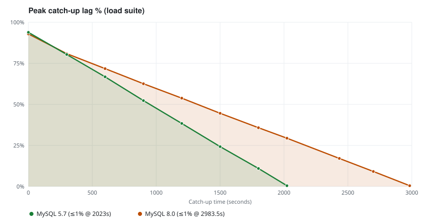

# go-cdc

[English](README.md)

## 简介

go-cdc 是一个用 YAML 描述同步作业的 CDC 工具：从 MySQL 捕获全量与增量变更，可选变换与路由后，写出到 **标准输出** 或 **MySQL**。一个进程、一份配置、一个二进制：`go-cdc`。

本版本能力：

- MySQL 源（全量快照 + binlog）
- Stdout Sink（换行 JSON）与 MySQL Sink
- 列投影、行过滤、表路由、结构变更策略、文件检查点

## 环境构建

| 项 | 要求 |
| --- | --- |
| 操作系统 | Linux / macOS / Windows |
| Go | **1.25+**（见 `go.mod`） |
| 源 / 目标库 | MySQL **5.7** 或 **8.0** |
| 源库 binlog | `binlog_format=ROW`，`binlog_row_image=FULL` |

### 使用 `install.sh` / `install.ps1` 安装

从源码编译并安装 `go-cdc` 二进制。

| 平台 | 默认安装路径 | 脚本 |
| --- | --- | --- |
| Linux / macOS | `$HOME/bin` | [`install.sh`](install.sh) |
| Windows | `%USERPROFILE%\bin` | [`install.ps1`](install.ps1) |

**Linux / macOS**

```bash
# 用户目录 → $HOME/bin
curl -sSfL https://raw.githubusercontent.com/PyRSA/go-cdc/main/install.sh | bash -s

# 安装到 $(go env GOPATH)/bin
curl -sSfL https://raw.githubusercontent.com/PyRSA/go-cdc/main/install.sh | bash -s -- -b "$(go env GOPATH)/bin"

# 安装到当前目录 ./bin
curl -sSfL https://raw.githubusercontent.com/PyRSA/go-cdc/main/install.sh | bash -s -- -b ./bin

# 全局 → /usr/local/bin（可能需要 sudo）
curl -sSfL https://raw.githubusercontent.com/PyRSA/go-cdc/main/install.sh | bash -s -- --global
```

本地仓库：

```bash
git clone https://github.com/PyRSA/go-cdc.git
cd go-cdc

./install.sh                  # $HOME/bin
./install.sh --user           # 同默认
./install.sh --global         # /usr/local/bin
./install.sh -b /opt/go-cdc/bin
make build                    # 仅编译 → ./bin/go-cdc
```

**Windows（PowerShell）**

```powershell
# 一键安装（编译并装到 %USERPROFILE%\bin，并更新用户 PATH）
irm https://raw.githubusercontent.com/PyRSA/go-cdc/main/install.ps1 | iex

# 或在本地仓库执行
git clone https://github.com/PyRSA/go-cdc.git
cd go-cdc

.\install.ps1
.\install.ps1 -BinDir "$env:USERPROFILE\bin"
.\install.ps1 -BinDir "$(go env GOPATH)\bin"
```

可选检查：

```bash
make fmt-check   # gofmt
make lint        # golangci-lint（.golangci.yml）
make test        # go test -race
```

## 快速使用

文档见 [`docs/`](docs/)：

- [QuickStart](docs/QuickStart.md)
- [Pipeline](docs/pipeline.md)
- Source connectors
  - [MySQL Source](docs/connectors/mysql-source.md)
- Sink connectors
  - [MySQL Sink](docs/connectors/mysql-sink.md)
  - [Stdout Sink](docs/connectors/stdout-sink.md)

**最小示例（MySQL → stdout）：**

1. 编辑 [`configs/demo-stdout.yaml`](configs/demo-stdout.yaml)（地址、账号、`tables`）。
2. 启动作业：

```bash
./bin/go-cdc configs/demo-stdout.yaml
```

3. MySQL → MySQL 请使用 [`configs/demo-mysql.yaml`](configs/demo-mysql.yaml)。

## 性能

go-cdc 在 GitHub Actions 中跑自动化 MySQL 集成与规模测试，覆盖全量快照、
增量 CDC、多库同步、热点表压力，以及持续写入积压下的追平行为。

下表为同日 `master` CI（2026-09-30）。**源端写入**与 **CDC apply** 是不同指标。

### 负载测试（Load）

| 指标 | MySQL 5.7.42 | MySQL 8.0.36 |
| --- | --- | --- |
| **测试类型** | **Load**（func + types + load） | **Load**（func + types + load） |
| 快照 | 约 50 万行 / 168.5s | 约 50 万行 / 228.7s |
| 峰值源端写入 | 305 万行 / 90s（约 3.4 万行/s） | 224 万行 / 90s（约 2.5 万行/s） |
| 受压表 | 2（`tpl01_t1` + typed） | 2（`tpl01_t1` + typed） |
| CDC 合计 apply | 约 2.9K 行/s（两表合计） | 约 1.5K 行/s（两表合计） |
| CDC 追平 | 2023s（约 34 min）内 lag ≤1% | 2983.5s（约 50 min）内 lag ≤1% |
| 结果 | **PASS** | **PASS** |

追平曲线（5.7 vs 8.0）：   
。

### 规模测试（Scale heavy）

仅 MySQL **8.0.36**（CI 无 5.7 scale 矩阵）：10 个源库、50 张表，含并发热点负载。

| 指标 | 结果 |
| --- | --- |
| **测试类型** | **Scale**（heavy） |
| 库 / 表 | 10 库 / 50 表 |
| 快照 | 30 万行 / 104.1s |
| 热点 burst | 50 万行 / 15.7s |
| 峰值源端写入 | 135.6 万行 / 45s（约 3 万行/s） |
| 热点表 | 10 |
| CDC 合计 apply | 约 3.1K 行/s（10 张热点表合计） |
| CDC 追平 | 577s 内 lag ≤1% |
| 最终校验 | COUNT + SUM(id) + CRC 通过 |
| 结果 | **PASS** |

上述结果来自 GitHub Actions 共享 runner，不能当作厂商级 benchmark；实际表现
取决于 CI 环境、MySQL 配置、负载与测试参数。

完整工况、方法与 CI 明细见
[性能压测：MySQL → MySQL（E2E）](docs/performance/mysql-to-mysql-e2e.md)。

## 如何贡献

1. Fork 仓库并创建功能分支。
2. 改动尽量聚焦，遵循现有包结构（`cmd/`、`composer/`、`connector/`、`runtime/`）。
3. 提交 PR 前请本地执行：
   - `make fmt-check`
   - `make lint`
   - `make test`
   - 若改动同步链路，尽量跑集成测试：`make integration-up && make integration-test && make integration-down`
4. 在 PR 中说明问题与验证方式。

集成测试说明：[test/integration/README.zh.md](test/integration/README.zh.md)。

## 许可

本项目使用 [MIT License](LICENSE)。
