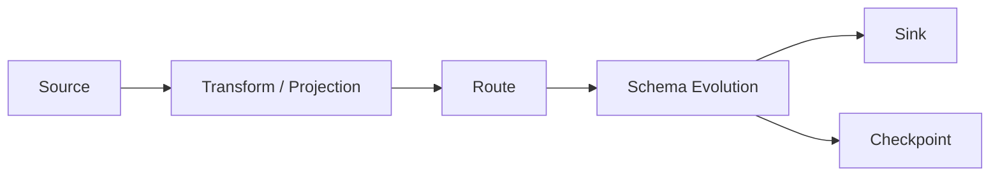

# Data Pipeline

A pipeline is defined in YAML. Data flows from **Source**, optionally through **Transform** (including **Projection**, filter, and business keys), then **Route**, **Schema Evolution**, and finally **Sink**. **Checkpoint** records progress.



Allowed top-level keys: `source`, `sink`, `route`, `transform`, `pipeline`, `checkpoint`. Unknown keys fail startup.

---

## Source

Captures snapshot and incremental changes. Only MySQL is supported.

| `source.type` | Doc |
| --- | --- |
| `mysql` | [connectors/mysql-source.md](connectors/mysql-source.md) |

---

## Sink

Writes results. Supported types:

| `sink.type` | Doc |
| --- | --- |
| `stdout` | [connectors/stdout-sink.md](connectors/stdout-sink.md) |
| `mysql` | [connectors/mysql-sink.md](connectors/mysql-sink.md) |

`kafka`, `doris`, and `elasticsearch` are **not** available in this release (startup fails if configured).

---

## Transform

Optional. Top-level list `transform:`. Each rule matches source tables and may set projection, filter, and business keys.

| Option | Required | Description |
| --- | --- | --- |
| `source-table` | yes | Regex matching full `database.table` |
| `projection` | no | Column projection; see [Projection](#projection) |
| `filter` | no | Row filter, e.g. `city = 'hz'`; non-matching rows are not written (updates may retract) |
| `primary-keys` | no | Business key columns (comma-separated) |
| `description` | no | Comment only |

```yaml
transform:
  - source-table: demo_db\.orders
    projection: id, city, amt
    filter: city = 'hz'
    primary-keys: id
    description: only hz orders
```

Rules are applied in order; the first matching `source-table` wins for that event.

---

## Projection

Projection is the `projection` field under **Transform**. There is no top-level `projection:` block.

| Syntax | Meaning |
| --- | --- |
| Omit `projection` | Keep all columns (after filter) |
| `id, name, city` | Keep only listed columns |
| `*` | Keep all columns (cannot mix with other names) |

Notes:

- Column names must exist on the source table.
- If `primary-keys` is set, keys dropped by projection are not carried onto the sink table schema.

---

## Route

Optional. Maps source table names to sink `database.table`. If omitted, events keep the source `database` / `table`.

| Option | Required | Description |
| --- | --- | --- |
| `source-table` | yes | Regex matching full `database.table` |
| `sink-table` | yes | Target `database.table` (must contain `.`) |
| `replace-symbol` | no | Placeholder in `sink-table` replaced by the matched **source table** name |
| `description` | no | Comment only |

```yaml
route:
  - source-table: demo_db\.orders
    sink-table: demo_sink.orders
  - source-table: demo_db\.(.*)
    sink-table: demo_sink.<>
    replace-symbol: "<>"
```

Route mode under `pipeline`:

| Option | Default | Description |
| --- | --- | --- |
| `pipeline.route-mode` | `ALL_MATCH` | `ALL_MATCH` or `FIRST_MATCH` |

Other `pipeline` options:

| Option | Required | Default | Description |
| --- | --- | --- | --- |
| `name` | yes | `cdc` | Job name (used in checkpoint path) |
| `parallelism` | no | `1` | Snapshot parallelism (≥ 1) |

---

## Schema Evolution

DDL comes from the source when `source.schema-change.enabled` is `true` (default). The job decides what reaches the sink based on DDL kind and projection.

### Related options

| Location | Option | Default | Description |
| --- | --- | --- | --- |
| `source` | `schema-change.enabled` | `true` | Capture DDL when `true` |
| `sink` | `schema.change.drop-truncate.enabled` | `false` | Allow DROP TABLE / TRUNCATE on MySQL sink when `true` |

### Behavior summary

| DDL kind | Behavior |
| --- | --- |
| Add / drop / modify / rename column | May be applied after projection trimming |
| DROP TABLE / TRUNCATE | Only if `schema.change.drop-truncate.enabled: true` |
| CREATE TABLE (raw statement) | Not applied as raw SQL; sink tables come from inferred schema / `auto-create-table` |
| Other (e.g. index-only) | Usually not executed on MySQL sink |

Stdout sink prints `"op":"ddl"` for DDL that passes the policy.

Details: [MySQL Source](connectors/mysql-source.md), [MySQL Sink](connectors/mysql-sink.md).

---

## Checkpoint

Optional. Used for resume after restart.

| Option | Required | Default | Description |
| --- | --- | --- | --- |
| `storage` | no | `file` | Only `file` is supported |
| `interval` | no | `10s` | Save interval |
| `file-path` | no | `./checkpoints` | Directory; final file is `<file-path>/<pipeline.name>/<md5>.ckpt` |

```yaml
checkpoint:
  storage: file
  interval: 10s
  file-path: ./checkpoints
```

---

## Skeleton Example

```yaml
source:
  type: mysql
  # … see mysql-source.md
sink:
  type: mysql   # or stdout — see sink docs
  # …
transform:
  - source-table: demo_db\.orders
    projection: id, city, amt
    filter: city = 'hz'
    primary-keys: id
route:
  - source-table: demo_db\.orders
    sink-table: demo_sink.orders
pipeline:
  name: demo
  parallelism: 1
  route-mode: ALL_MATCH
checkpoint:
  storage: file
  interval: 10s
  file-path: ./checkpoints
```

## Related Docs

- [QuickStart](QuickStart.md)
- Source connectors
  - [MySQL Source](connectors/mysql-source.md)
- Sink connectors
  - [MySQL Sink](connectors/mysql-sink.md)
  - [Stdout Sink](connectors/stdout-sink.md)
