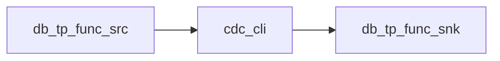

# go-cdc integration test report (expected vs actual)

## 0. Overview

- Run time: 2026-09-29 16:13:32
- Source: `127.0.0.1:13306` / `u_a7k9m2x4` / `db_tp_func_src`
- Sink: `127.0.0.1:13306` / `u_b3j6c8y1` / `db_tp_func_snk`
- Entry point: `/home/guopengjia/workspace/go-cdc/test/integration/workdir/go-cdc <pipeline.yaml>`
- **Summary: pass 14 / fail 0 / total 14** → **all passed**

| TP | Name | Result |
| --- | --- | --- |
| TP-01 | Initial snapshot + projection/filter (city=hz) | ✅ PASS |
| TP-02 | Business key docid: old key gone, new key kept | ✅ PASS |
| TP-03 | Same-key update overwrites (no extra row) | ✅ PASS |
| TP-04 | Filter miss retract (sink delete) | ✅ PASS |
| TP-05 | Filter: match enters / miss excluded | ✅ PASS |
| TP-06 | DELETE retracts by before-image key | ✅ PASS |
| TP-07 | Create-table failure does not exclude table; job continues | ✅ PASS |
| TP-08 | Extra projected columns not applied; in-projection type change applied | ✅ PASS |
| TP-09 | After stop, add existing table: backfill that table only | ✅ PASS |
| TP-10 | Runtime CREATE TABLE: follows incremental and updates captured | ✅ PASS |
| TP-12 | Resume state: splits and offset in one file | ✅ PASS |
| TP-13 | Abnormal stop (SIGKILL) then resume from checkpoint | ✅ PASS |
| TP-07b | Write after create failure: missing table fails job | ✅ PASS |
| TP-11 | stdout CRUD: u with before/after + ddl | ✅ PASS |

## 1. Data flow



## TP-01 Initial snapshot + projection/filter (city=hz)

- **Result: ✅ PASS**
- **Action:** First start: project id,name,city; filter city='hz'
- **Expected:** Sink has id=1,3 only; no amount; no id=2

### Expected

| id | name | city |
| --- | --- | --- |
| 1 | alice | hz |
| 3 | ann | hz |

### Actual

| id | name | city |
| --- | --- | --- |
| 1 | alice | hz |
| 3 | ann | hz |

### Expected vs actual

| Key/# | exp.id | exp.name | exp.city | act.id | act.name | act.city | Verdict |
| --- | --- | --- | --- | --- | --- | --- | --- |
| 1 | 1 | alice | hz | 1 | alice | hz | ✅ |
| 3 | 3 | ann | hz | 3 | ann | hz | ✅ |
| Summary | | | | | **✅ PASS** |

### Extra evidence

- Sink columns: `['city', 'id', 'name']` → ✅
- Filtered-out id=2: ✅ absent


## TP-02 Business key docid: old key gone, new key kept

- **Result: ✅ PASS**
- **Action:** UPDATE tp02_keys SET docid='B', title='title-b'
- **Expected:** Sink only (B, title-b)

### Expected

| docid | title |
| --- | --- |
| B | title-b |

### Actual

| docid | title |
| --- | --- |
| B | title-b |

### Expected vs actual

| Key/# | exp.docid | exp.title | act.docid | act.title | Verdict |
| --- | --- | --- | --- | --- | --- |
| B | B | title-b | B | title-b | ✅ |
| Summary | | | | | **✅ PASS** |

### Extra evidence

- No id column: ✅


## TP-03 Same-key update overwrites (no extra row)

- **Result: ✅ PASS**
- **Action:** UPDATE tp01_rows SET name='alice2' WHERE id=1
- **Expected:** Still two rows; id=1 name=alice2

### Expected

| id | name | city |
| --- | --- | --- |
| 1 | alice2 | hz |
| 3 | ann | hz |

### Actual

| id | name | city |
| --- | --- | --- |
| 1 | alice2 | hz |
| 3 | ann | hz |

### Expected vs actual

| Key/# | exp.id | exp.name | exp.city | act.id | act.name | act.city | Verdict |
| --- | --- | --- | --- | --- | --- | --- | --- |
| 1 | 1 | alice2 | hz | 1 | alice2 | hz | ✅ |
| 3 | 3 | ann | hz | 3 | ann | hz | ✅ |
| Summary | | | | | **✅ PASS** |

## TP-04 Filter miss retract (sink delete)

- **Result: ✅ PASS**
- **Action:** UPDATE tp01_rows SET city='bj' WHERE id=3 (source no longer matches city='hz')
- **Expected:** Sink deletes id=3; only rows still matching filter remain

### Expected

| id | name | city |
| --- | --- | --- |
| 1 | alice2 | hz |

### Actual

| id | name | city |
| --- | --- | --- |
| 1 | alice2 | hz |

### Expected vs actual

| Key/# | exp.id | exp.name | exp.city | act.id | act.name | act.city | Verdict |
| --- | --- | --- | --- | --- | --- | --- | --- |
| 1 | 1 | alice2 | hz | 1 | alice2 | hz | ✅ |
| Summary | | | | | **✅ PASS** |

### Extra evidence

- Semantics: filter slide-out → retract delete on sink


## TP-05 Filter: match enters / miss excluded

- **Result: ✅ PASS**
- **Action:** INSERT (4,cara,hz), (5,dave,sh)
- **Expected:** Has cara; no dave; no retracted id=3

### Expected

| id | name | city |
| --- | --- | --- |
| 1 | alice2 | hz |
| 4 | cara | hz |

### Actual

| id | name | city |
| --- | --- | --- |
| 1 | alice2 | hz |
| 4 | cara | hz |

### Expected vs actual

| Key/# | exp.id | exp.name | exp.city | act.id | act.name | act.city | Verdict |
| --- | --- | --- | --- | --- | --- | --- | --- |
| 1 | 1 | alice2 | hz | 1 | alice2 | hz | ✅ |
| 4 | 4 | cara | hz | 4 | cara | hz | ✅ |
| Summary | | | | | **✅ PASS** |

## TP-06 DELETE retracts by before-image key

- **Result: ✅ PASS**
- **Action:** DELETE FROM tp01_rows WHERE id=1
- **Expected:** No id=1; id=4 remains

### Expected

| id | name | city |
| --- | --- | --- |
| 4 | cara | hz |

### Actual

| id | name | city |
| --- | --- | --- |
| 4 | cara | hz |

### Expected vs actual

| Key/# | exp.id | exp.name | exp.city | act.id | act.name | act.city | Verdict |
| --- | --- | --- | --- | --- | --- | --- | --- |
| 4 | 4 | cara | hz | 4 | cara | hz | ✅ |
| Summary | | | | | **✅ PASS** |

## TP-07 Create-table failure does not exclude table; job continues

- **Result: ✅ PASS**
- **Action:** tp07_fail routed to no_such_db (empty source); create-table fails
- **Expected:** Not in excluded; no tp07_fail sink table; tp01_rows continue; job does not exit

### Expected

| ok |
| --- |
| yes |

### Actual

| ok |
| --- |
| yes |

### Expected vs actual

| Check | Expected | Actual | Verdict |
| --- | --- | --- | --- |
| tp07_fail not in excluded_tables | yes | yes | ✅ |
| db_tp_func_snk.tp07_fail_out absent | yes | yes | ✅ |
| tp01_rows still syncing | >=1 rows | 1 rows | ✅ |
| job still running | yes | yes | ✅ |
| resume offset shape | file+pos or gtid | file+pos+gtid | ✅ |
| Summary | | | **✅ PASS** |

## TP-08 Extra projected columns not applied; in-projection type change applied

- **Result: ✅ PASS**
- **Action:** ADD remark/tag；MODIFY name VARCHAR(128)
- **Expected:** Columns still id,name,city; name=varchar(128)

### Expected

| columns | name_type |
| --- | --- |
| id,name,city | varchar(128) |

### Actual

| columns | name_type |
| --- | --- |
| id,name,city | varchar(128) |

### Expected vs actual

| Check | Expected | Actual | Verdict |
| --- | --- | --- | --- |
| Column set | id,name,city | ['id', 'name', 'city'] | ✅ |
| name type | varchar(128) | varchar(128) | ✅ |
| Summary | | | **✅ PASS** |

### Extra evidence

| name | type |
| --- | --- |
| id | bigint |
| name | varchar(128) |
| city | varchar(32) |


## TP-09 After stop, add existing table: backfill that table only

- **Result: ✅ PASS**
- **Action:** Add tp09_add to config and restart from saved resume state
- **Expected:** tp09_add=(7,add-row); tp01_rows unchanged; no id=2

### Expected

| id | name |
| --- | --- |
| 7 | add-row |

### Actual

| id | name |
| --- | --- |
| 7 | add-row |

### Expected vs actual

| Key/# | exp.id | exp.name | act.id | act.name | Verdict |
| --- | --- | --- | --- | --- | --- |
| 7 | 7 | add-row | 7 | add-row | ✅ |
| Summary | | | | | **✅ PASS** |

### Extra evidence

#### tp01_rows before restart
| id | name | city |
| --- | --- | --- |
| 4 | cara | hz |

#### tp01_rows after restart
| id | name | city |
| --- | --- | --- |
| 4 | cara | hz |

- id=2 backfilled: ✅ no


## TP-10 Runtime CREATE TABLE: follows incremental and updates captured

- **Result: ✅ PASS**
- **Action:** Runtime CREATE tp10_ddl + INSERT (9,ddl-row)
- **Expected:** Sink (9,ddl-row); captured includes tp10_ddl

### Expected

| id | name |
| --- | --- |
| 9 | ddl-row |

### Actual

| id | name |
| --- | --- |
| 9 | ddl-row |

### Expected vs actual

| Check | Expected | Actual | Verdict |
| --- | --- | --- | --- |
| sink row (9,ddl-row) | present | yes | ✅ |
| captured_tables contains tp10_ddl | yes | yes | ✅ |
| Summary | | | **✅ PASS** |

## TP-12 Resume state: splits and offset in one file

- **Result: ✅ PASS**
- **Action:** snapshot + incremental, interval=2s
- **Expected:** One resume-state file with a well-formed offset (file+pos or gtid)

### Expected

| file | acked |
| --- | --- |
| 1 | yes |

### Actual

| file | acked |
| --- | --- |
| 1 | yes |

### Expected vs actual

| Check | Expected | Actual | Verdict |
| --- | --- | --- | --- |
| single resume-state file | yes | yes | ✅ |
| resume offset recorded | yes | yes | ✅ |
| offset shape | file+pos or gtid | file+pos+gtid | ✅ |
| split progress recorded | optional | yes | ✅ |
| Summary | | | **✅ PASS** |

## TP-13 Abnormal stop (SIGKILL) then resume from checkpoint

- **Result: ✅ PASS**
- **Action:** Wait for flushed acked_offset → SIGKILL (no graceful flush) → INSERT id=13 while down → restart same YAML
- **Expected:** Checkpoint on disk still valid; old sink rows kept; downtime INSERT caught up; no filtered-row resurrection

### Expected

| ok |
| --- |
| yes |

### Actual

| ok |
| --- |
| yes |

### Expected vs actual

| Check | Expected | Actual | Verdict |
| --- | --- | --- | --- |
| SIGKILL exit non-zero | yes | code=-9 | ✅ |
| checkpoint survived kill | yes | file+pos+gtid | ✅ |
| pre-kill sink rows kept | unchanged | yes | ✅ |
| downtime INSERT id=13 synced | yes | yes | ✅ |
| filtered id=2 still absent | yes | yes | ✅ |
| tp09_add unchanged | yes | yes | ✅ |
| job running after restart | yes | True | ✅ |
| Summary | | | **✅ PASS** |

### Extra evidence

#### tp01_rows_out before kill
| id | name | city |
| --- | --- | --- |
| 4 | cara | hz |

#### tp01_rows_out after resume
| id | name | city |
| --- | --- | --- |
| 4 | cara | hz |
| 13 | crash-resume | hz |

- offset before kill: `file+pos+gtid`


## TP-07b Write after create failure: missing table fails job

- **Result: ✅ PASS**
- **Action:** INSERT INTO tp07_fail (routed to no_such_db)
- **Expected:** Write fails on missing table; job fails; no silent drop from create failure

### Expected

| ok |
| --- |
| yes |

### Actual

| ok |
| --- |
| yes |

### Expected vs actual

| Check | Expected | Actual | Verdict |
| --- | --- | --- | --- |
| job exit code non-zero | yes | 1 | ✅ |
| log mentions missing table | yes | True | ✅ |
| Summary | | | **✅ PASS** |

### Extra evidence

```
time=2026-09-29T16:13:13.431+08:00 level=ERROR msg="pipeline failed" err="sink.mysql: table no_such_db.tp07_fail_out does not exist: Error 1142 (42000): INSERT, UPDATE command denied to user 'u_b3j6c8y1'@'172.22.0.1' for table 'tp07_fail_out'"

```


## TP-11 stdout CRUD: u with before/after + ddl

- **Result: ✅ PASS**
- **Action:** stdout sink；UPDATE cara→cara2；ADD tag2
- **Expected:** Single-line u(before+after) and ddl(tag2) appear

### Expected

| ops |
| --- |
| u,ddl |

### Actual

| ops |
| --- |
| u=True,u_ba=True,ddl=True |

### Expected vs actual

| Check | Expected | Actual | Verdict |
| --- | --- | --- | --- |
| op=u | present | True | ✅ |
| u has before+after | present | True | ✅ |
| ddl mentions tag2 | present | True | ✅ |
| Summary | | | **✅ PASS** |

### Extra evidence

```
time=2026-09-29T16:13:14.431+08:00 level=INFO msg="pipeline loaded" name=tp_func_stdout sink=stdout startup=initial
time=2026-09-29T16:13:14.434+08:00 level=INFO msg="create BinlogSyncer" config="{ServerID:5612 Flavor:mysql Host:127.0.0.1 Port:13306 User:u_a7k9m2x4 Password: Localhost: Charset:utf8mb4 SemiSyncEnabled:false RawModeEnabled:false TLSConfig:<nil> ParseTime:false TimestampStringLocation:Asia/Shanghai UseDecimal:false UseFloatWithTrailingZero:false RenderJSONAsMySQLText:false RecvBufferSize:0 HeartbeatPeriod:30s ReadTimeout:0s MaxReconnectAttempts:0 DisableRetrySync:false VerifyChecksum:false DumpCommandFlag:0 Option:<nil> Logger:0xc00006d180 Dialer:0x773540 RowsEventDecodeFunc:0x9533c0 TableMapOptionalMetaDecodeFunc:<nil> DiscardGTIDSet:false EventCacheCount:10240 FillZeroLogPos:false PayloadDecoderConcurrency:0 SynchronousEventHandler:<nil>}"
{"op":"r","database":"db_tp_func_src","table":"tp01_rows","before":null,"after":{"city":"hz","id":4,"name":"cara"}}
{"op":"r","database":"db_tp_func_src","table":"tp01_rows","before":null,"after":{"city":"hz","id":13,"name":"crash-resume"}}
time=2026-09-29T16:13:14.466+08:00 level=INFO msg="skip dump, use last binlog replication position or GTID set" file="" position=0 "GTID set"=02152641-bbac-11f1-828a-0242ac160002:1-76218
time=2026-09-29T16:13:14.466+08:00 level=INFO msg="begin to sync binlog from GTID set" "GTID set"=02152641-bbac-11f1-828a-0242ac160002:1-76218
time=2026-09-29T16:13:14.468+08:00 level=INFO msg="Connected to server" flavor=mysql version=8.0.36
time=2026-09-29T16:13:14.468+08:00 level=INFO msg="start sync binlog at GTID set" gset=02152641-bbac-11f1-828a-0242ac160002:1-76218
time=2026-09-29T16:13:14.484+08:00 level=INFO msg="rotate to next binlog" file=mysql-bin.000004 position=4
time=2026-09-29T16:13:14.485+08:00 level=INFO msg="received fake rotate event" nextLogName=mysql-bin.000004
time=2026-09-29T16:13:14.485+08:00 level=INFO msg="log name changed, the fake rotate event will be handled as a real rotate event"
time=2026-09-29T16:13:14.485+08:00 level=INFO msg="rotate binlog" pos="(mysql-bin.000004, 4)"
{"op":"u","database":"db_tp_func_src","table":"tp01_rows","before":{"city":"hz","id":4,"name":"cara"},"after":{"city":"hz","id":4,"name":"cara2"}}
time=2026-09-29T16:13:24.468+08:00 level=INFO msg="table structure changed, clear table cache" database=db_tp_func_src table=tp01_rows
{"op":"ddl","database":"db_tp_func_src","table":"tp01_rows","ddl":"ALTER TABLE tp01_rows ADD COLUMN tag2 VARCHAR(16) NULL"}
time=2026-09-29T16:13:32.490+08:00 level=INFO msg="pipeline stopped" name=tp_func_stdout
```


## Appendix: source table snapshots

### source db_tp_func_src.tp01_rows

| id | name | city | amount | remark | tag | tag2 |
| --- | --- | --- | --- | --- | --- | --- |
| 2 | bob | sh | 3.00 | NULL | NULL | NULL |
| 3 | ann | bj | NULL | NULL | NULL | NULL |
| 4 | cara2 | hz | 1.00 | NULL | NULL | NULL |
| 5 | dave | sh | 2.00 | NULL | NULL | NULL |
| 13 | crash-resume | hz | 0.13 | NULL | NULL | NULL |

### source db_tp_func_src.tp02_keys

| id | docid | title |
| --- | --- | --- |
| 1 | B | title-b |

### source db_tp_func_src.tp09_add

| id | name |
| --- | --- |
| 7 | add-row |

### source db_tp_func_src.tp10_ddl

| id | name |
| --- | --- |
| 9 | ddl-row |

## Appendix: sink table snapshots

### sink db_tp_func_snk.tp01_rows_out

| id | name | city |
| --- | --- | --- |
| 4 | cara | hz |
| 13 | crash-resume | hz |

### sink db_tp_func_snk.tp02_keys_out

| docid | title |
| --- | --- |
| B | title-b |

### sink db_tp_func_snk.tp09_add_out

| id | name |
| --- | --- |
| 7 | add-row |

### sink db_tp_func_snk.tp10_ddl_out

| id | name |
| --- | --- |
| 9 | ddl-row |
