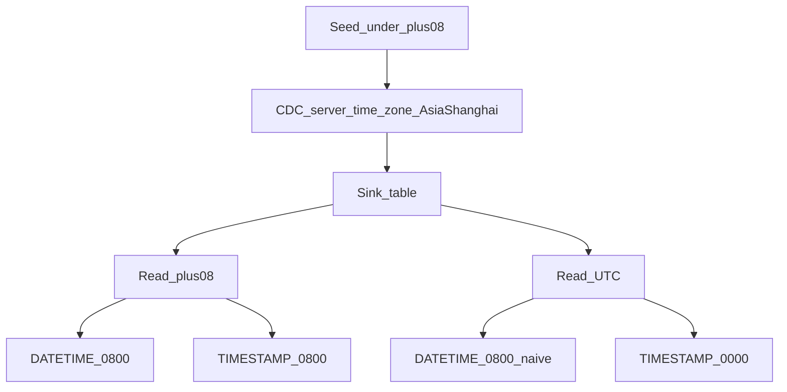

# go-cdc types / timezone integration test report

## 0. Overview

- Run time: 2026-09-29 16:13:40
- MySQL：`127.0.0.1:13306`（default-time-zone=UTC）
- CDC `server-time-zone`: Asia/Shanghai; assert session: `+08:00`
- Source: `db_tp_types_src.tpd01_types` → sink: `db_tp_types_snk.tpd01_types_out`
- **Summary: pass 4 / fail 0 / total 4** → **all passed**

| TP | Name | Result |
| --- | --- | --- |
| TP-D01 | Initial snapshot: full type round-trip (incl. temporal) | ✅ PASS |
| TP-D02 | Incremental UPDATE: temporal fields stable via binlog | ✅ PASS |
| TP-D03 | Timezone semantics: DATETIME naive / TIMESTAMP session-dependent | ✅ PASS |
| TP-D04 | Auto DDL: key type precision preserved | ✅ PASS |

## Type coverage matrix

| Category | Columns |
| --- | --- |
| Integer | tinyint / tinyint unsigned / smallint / int / bigint / bigint unsigned |
| Decimal | decimal(10,4) / numeric(18,6) / float / double |
| String | char / varchar / text |
| Temporal | date / time(3) / datetime(6) / timestamp(6) |
| Other | json / enum / set / bit / bool / blob / binary / NULL |

## TP-D01 Initial snapshot: full type round-trip (incl. temporal)

- **Result: ✅ PASS**
- **Action:** initial snapshot tpd01_types; assert session time_zone=+08:00
- **Expected:** Source/sink wall-clock match at +08:00 for DATE/TIME/DATETIME/TIMESTAMP; numeric/string/JSON/BIT/BLOB match

### Expected

| Column | row1 | row2 |
| --- | --- | --- |
| id | 1 | 2 |
| c_tinyint | -12 | 0 |
| c_tinyint_u | 200 | 0 |
| c_smallint | -30000 | 0 |
| c_int | 123456789 | 0 |
| c_bigint | -9007199254740991 | 0 |
| c_bigint_u | 18446744073709551615 | 0 |
| c_decimal | 1234.5678 | 0.0000 |
| c_numeric | 9876543210.123456 | 0.000000 |
| c_float | 3.1415 | 0 |
| c_double | 2.718281828459 | 0 |
| c_char | abcdefgh |  |
| c_varchar | hello-world |  |
| c_text | text-line-1
text-line-2 |  |
| c_date | 2024-03-15 | 1970-01-01 |
| c_time | 13:45:30.123000 | 00:00:00.000000 |
| c_datetime | 2024-03-15 13:45:30.123456 | 1970-01-01 00:00:00.000000 |
| c_timestamp | 2024-03-15 13:45:30.123456 | NULL |
| c_json | {"k": "v", "n": 1} | NULL |
| c_enum | green | red |
| c_set | x,z | y |
| c_bit | AA | 00 |
| c_bool | 1 | 0 |
| c_blob | DEADBEEF | NULL |
| c_binary | 01020304 | 00000000 |
| c_null_int | NULL | NULL |

### Actual

| Column | row1 | row2 |
| --- | --- | --- |
| id | 1 | 2 |
| c_tinyint | -12 | 0 |
| c_tinyint_u | 200 | 0 |
| c_smallint | -30000 | 0 |
| c_int | 123456789 | 0 |
| c_bigint | -9007199254740991 | 0 |
| c_bigint_u | 18446744073709551615 | 0 |
| c_decimal | 1234.5678 | 0.0000 |
| c_numeric | 9876543210.123456 | 0.000000 |
| c_float | 3.1415 | 0 |
| c_double | 2.718281828459 | 0 |
| c_char | abcdefgh |  |
| c_varchar | hello-world |  |
| c_text | text-line-1
text-line-2 |  |
| c_date | 2024-03-15 | 1970-01-01 |
| c_time | 13:45:30.123000 | 00:00:00.000000 |
| c_datetime | 2024-03-15 13:45:30.123456 | 1970-01-01 00:00:00.000000 |
| c_timestamp | 2024-03-15 13:45:30.123456 | NULL |
| c_json | {"k": "v", "n": 1} | NULL |
| c_enum | green | red |
| c_set | x,z | y |
| c_bit | AA | 00 |
| c_bool | 1 | 0 |
| c_blob | DEADBEEF | NULL |
| c_binary | 01020304 | 00000000 |
| c_null_int | NULL | NULL |

### Compare

#### id=1
| Column | Expected | Actual | Verdict |
| --- | --- | --- | --- |
| `id` | `1` | `1` | ✅ |
| `c_tinyint` | `-12` | `-12` | ✅ |
| `c_tinyint_u` | `200` | `200` | ✅ |
| `c_smallint` | `-30000` | `-30000` | ✅ |
| `c_int` | `123456789` | `123456789` | ✅ |
| `c_bigint` | `-9007199254740991` | `-9007199254740991` | ✅ |
| `c_bigint_u` | `18446744073709551615` | `18446744073709551615` | ✅ |
| `c_decimal` | `1234.5678` | `1234.5678` | ✅ |
| `c_numeric` | `9876543210.123456` | `9876543210.123456` | ✅ |
| `c_float` | `3.1415` | `3.1415` | ✅ |
| `c_double` | `2.718281828459` | `2.718281828459` | ✅ |
| `c_char` | `abcdefgh` | `abcdefgh` | ✅ |
| `c_varchar` | `hello-world` | `hello-world` | ✅ |
| `c_text` | `text-line-1
text-line-2` | `text-line-1
text-line-2` | ✅ |
| `c_date` | `2024-03-15` | `2024-03-15` | ✅ |
| `c_time` | `13:45:30.123000` | `13:45:30.123000` | ✅ |
| `c_datetime` | `2024-03-15 13:45:30.123456` | `2024-03-15 13:45:30.123456` | ✅ |
| `c_timestamp` | `2024-03-15 13:45:30.123456` | `2024-03-15 13:45:30.123456` | ✅ |
| `c_json` | `{"k": "v", "n": 1}` | `{"k": "v", "n": 1}` | ✅ |
| `c_enum` | `green` | `green` | ✅ |
| `c_set` | `x,z` | `x,z` | ✅ |
| `c_bit` | `AA` | `AA` | ✅ |
| `c_bool` | `1` | `1` | ✅ |
| `c_blob` | `DEADBEEF` | `DEADBEEF` | ✅ |
| `c_binary` | `01020304` | `01020304` | ✅ |
| `c_null_int` | `NULL` | `NULL` | ✅ |
| Summary | | | **✅ PASS** |

#### id=2
| Column | Expected | Actual | Verdict |
| --- | --- | --- | --- |
| `id` | `2` | `2` | ✅ |
| `c_tinyint` | `0` | `0` | ✅ |
| `c_tinyint_u` | `0` | `0` | ✅ |
| `c_smallint` | `0` | `0` | ✅ |
| `c_int` | `0` | `0` | ✅ |
| `c_bigint` | `0` | `0` | ✅ |
| `c_bigint_u` | `0` | `0` | ✅ |
| `c_decimal` | `0.0000` | `0.0000` | ✅ |
| `c_numeric` | `0.000000` | `0.000000` | ✅ |
| `c_float` | `0` | `0` | ✅ |
| `c_double` | `0` | `0` | ✅ |
| `c_char` | `` | `` | ✅ |
| `c_varchar` | `` | `` | ✅ |
| `c_text` | `` | `` | ✅ |
| `c_date` | `1970-01-01` | `1970-01-01` | ✅ |
| `c_time` | `00:00:00.000000` | `00:00:00.000000` | ✅ |
| `c_datetime` | `1970-01-01 00:00:00.000000` | `1970-01-01 00:00:00.000000` | ✅ |
| `c_timestamp` | `NULL` | `NULL` | ✅ |
| `c_json` | `NULL` | `NULL` | ✅ |
| `c_enum` | `red` | `red` | ✅ |
| `c_set` | `y` | `y` | ✅ |
| `c_bit` | `00` | `00` | ✅ |
| `c_bool` | `0` | `0` | ✅ |
| `c_blob` | `NULL` | `NULL` | ✅ |
| `c_binary` | `00000000` | `00000000` | ✅ |
| `c_null_int` | `NULL` | `NULL` | ✅ |
| Summary | | | **✅ PASS** |

### Notes

- Source default-time-zone expected UTC; CDC `server-time-zone=Asia/Shanghai`
- Assert query: `SET time_zone='+08:00'` + DATE_FORMAT/HEX/CAST

## TP-D02 Incremental UPDATE: temporal fields stable via binlog

- **Result: ✅ PASS**
- **Action:** UPDATE id=1 date/time/datetime/timestamp (session +08:00)
- **Expected:** Sink wall-clock matches source at +08:00; no ±8h drift

### Expected

| id | c_date | c_time | c_datetime | c_timestamp | c_varchar |
| --- | --- | --- | --- | --- | --- |
| 1 | 2025-01-01 | 23:59:59.999000 | 2024-12-31 23:59:59.999999 | 2024-12-31 23:59:59.999999 | after-binlog |

### Actual

| id | c_date | c_time | c_datetime | c_timestamp | c_varchar |
| --- | --- | --- | --- | --- | --- |
| 1 | 2025-01-01 | 23:59:59.999000 | 2024-12-31 23:59:59.999999 | 2024-12-31 23:59:59.999999 | after-binlog |

### Compare

| Column | Expected | Actual | Verdict |
| --- | --- | --- | --- |
| `id` | `1` | `1` | ✅ |
| `c_date` | `2025-01-01` | `2025-01-01` | ✅ |
| `c_time` | `23:59:59.999000` | `23:59:59.999000` | ✅ |
| `c_datetime` | `2024-12-31 23:59:59.999999` | `2024-12-31 23:59:59.999999` | ✅ |
| `c_timestamp` | `2024-12-31 23:59:59.999999` | `2024-12-31 23:59:59.999999` | ✅ |
| `c_varchar` | `after-binlog` | `after-binlog` | ✅ |
| Summary | | | **✅ PASS** |

## TP-D03 Timezone semantics: DATETIME naive / TIMESTAMP session-dependent

- **Result: ✅ PASS**
- **Action:** INSERT id=3 wall clock 2024-06-01 08:00:00 (+08:00); read sink at +08 and UTC
- **Expected:** DATETIME is TZ-naive → 08:00 in both +08 and UTC sessions; TIMESTAMP is absolute → 08:00 at +08, 00:00 at UTC

### Expected

| session | datetime | timestamp |
| --- | --- | --- |
| +08:00 | 2024-06-01 08:00:00 | 2024-06-01 08:00:00 |
| +00:00 | 2024-06-01 08:00:00 | 2024-06-01 00:00:00 |

### Actual

| session | datetime | timestamp |
| --- | --- | --- |
| +08:00 | 2024-06-01 08:00:00 | 2024-06-01 08:00:00 |
| +00:00 | 2024-06-01 08:00:00 | 2024-06-01 00:00:00 |

### Compare

| Read session time_zone | Field | Expected | Actual | Verdict |
| --- | --- | --- | --- | --- |
| +08:00 | DATETIME | `2024-06-01 08:00:00` | `2024-06-01 08:00:00` | ✅ |
| +08:00 | TIMESTAMP | `2024-06-01 08:00:00` | `2024-06-01 08:00:00` | ✅ |
| +00:00 | DATETIME | `2024-06-01 08:00:00` | `2024-06-01 08:00:00` | ✅ |
| +00:00 | TIMESTAMP | `2024-06-01 00:00:00` | `2024-06-01 00:00:00` | ✅ |
| Summary | | | | **✅ PASS** |

### Notes

## TP-D04 Auto DDL: key type precision preserved

- **Result: ✅ PASS**
- **Action:** Inspect sink information_schema column types
- **Expected:** decimal(10,4) / datetime(6) / timestamp(6) / time(3) / json / enum / bigint unsigned

### Expected

| k | t |
| --- | --- |
| c_decimal | decimal(10,4) |
| c_datetime | datetime(6) |
| c_timestamp | timestamp(6) |
| c_time | time(3) |
| c_json | json |
| c_enum | enum('red','green','blue') |
| c_bigint_u | bigint unsigned |

### Actual

| k | t |
| --- | --- |
| c_decimal | decimal(10,4) |
| c_datetime | datetime(6) |
| c_timestamp | timestamp(6) |
| c_time | time(3) |
| c_json | json |
| c_enum | enum('red','green','blue') |
| c_bigint_u | bigint unsigned |

### Compare

| Column | Expected type | Actual type | Verdict |
| --- | --- | --- | --- |
| c_decimal | `decimal(10,4)` | `decimal(10,4)` | ✅ |
| c_datetime | `datetime(6)` | `datetime(6)` | ✅ |
| c_timestamp | `timestamp(6)` | `timestamp(6)` | ✅ |
| c_time | `time(3)` | `time(3)` | ✅ |
| c_json | `json` | `json` | ✅ |
| c_enum | `enum('red','green','blue')` | `enum('red','green','blue')` | ✅ |
| c_bigint_u | `bigint unsigned` | `bigint unsigned` | ✅ |
| Summary | | | **✅ PASS** |

### Notes

| name | type | nullable |
| --- | --- | --- |
| id | bigint | NO |
| c_tinyint | tinyint | NO |
| c_tinyint_u | tinyint unsigned | NO |
| c_smallint | smallint | NO |
| c_int | int | NO |
| c_bigint | bigint | NO |
| c_bigint_u | bigint unsigned | NO |
| c_decimal | decimal(10,4) | NO |
| c_numeric | decimal(18,6) | NO |
| c_float | float | NO |
| c_double | double | NO |
| c_char | char(8) | NO |
| c_varchar | varchar(64) | NO |
| c_text | text | NO |
| c_date | date | NO |
| c_time | time(3) | NO |
| c_datetime | datetime(6) | NO |
| c_timestamp | timestamp(6) | YES |
| c_json | json | YES |
| c_enum | enum('red','green','blue') | NO |
| c_set | set('x','y','z') | NO |
| c_bit | bit(8) | NO |
| c_bool | tinyint(1) | NO |
| c_blob | blob | YES |
| c_binary | binary(4) | NO |
| c_null_int | int | YES |

